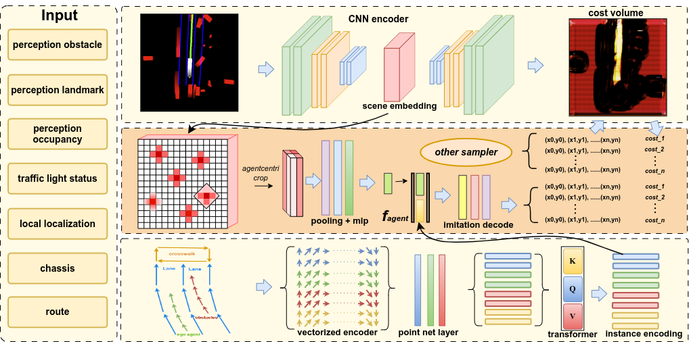

# GAD-Generative Learning for HD Map-Free Autonomous Driving
by Weijian Sun, Yanbo Jia, Qi Zeng, Zihao Liu, Jiang Liao, Yue Li, Xianfeng Li


<h3 align="center">
  <a href="https://arxiv.org/abs/2405.00515">arXiv</a> |
  <a href="">Video</a> |
  <a href="">Slides</a>
</h3>


| Method | Curve | Retrieval | Lane | Lattice | Model | video link |
| :---: | :---: | :---: | :---: | :---:|:---:| :---:| 
| UniAD |  |  |  |  | :heavy_check_mark:uni | [youtube]() & [bilibili]() |
| NMP | :heavy_check_mark: |  |  |  |  | [youtube]() & [bilibili]() |
| MP3 | | :heavy_check_mark: |  |  |  | [youtube]() & [bilibili]() |
| P3  | | | :heavy_check_mark: |  |  | [youtube]() & [bilibili]() |
| GAD-ref_free | :heavy_check_mark: | :heavy_check_mark: |  |  |  | [youtube]() & [bilibili]() |
| GAD-base|  |  |  | :heavy_check_mark:  | :heavy_check_mark: multi | [youtube]() & [bilibili]() |
| GAD-gan|  |  |  | :heavy_check_mark:  | :heavy_check_mark: gan | [youtube]() & [bilibili]() |

#Citing us
If you find our work useful, please consider citing:
```
@misc{sun2024gadgenerative,
      title={GAD-Generative Learning for HD Map-Free Autonomous Driving}, 
      author={Weijian Sun and Yanbo Jia and Qi Zeng and Zihao Liu and Jiang Liao and Yue Li and Xianfeng Li and Bolin Zhao},
      year={2024},
      eprint={2405.00515},
      archivePrefix={arXiv},
      primaryClass={cs.RO}
}
```